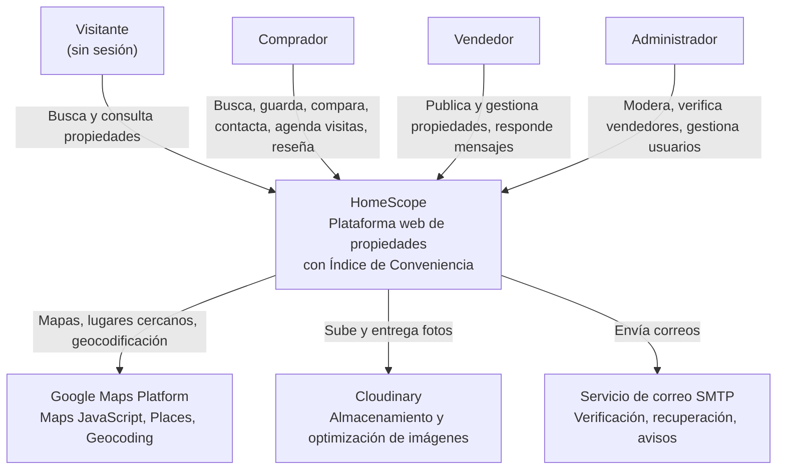
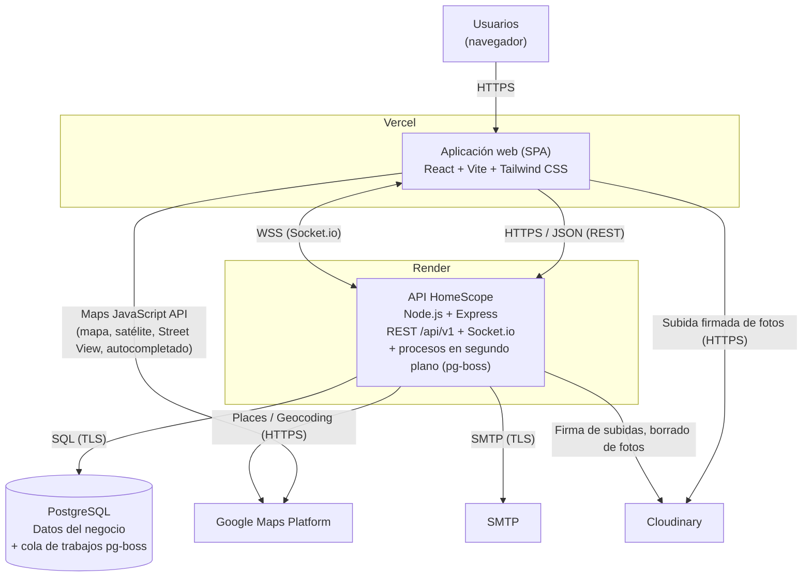
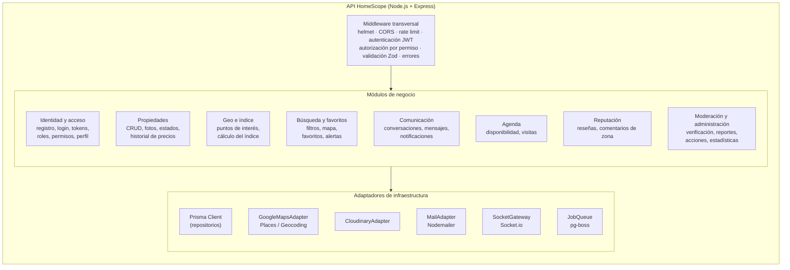
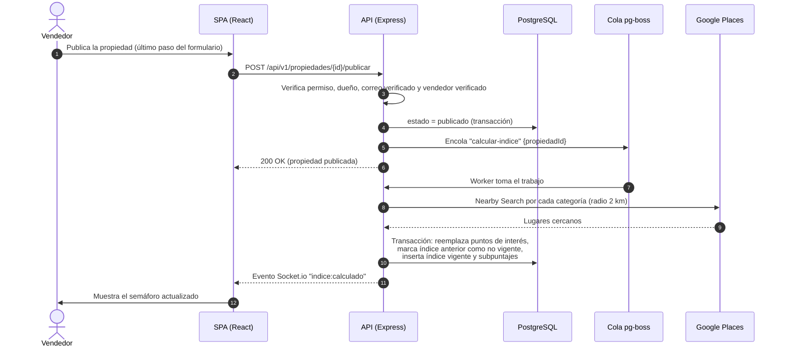
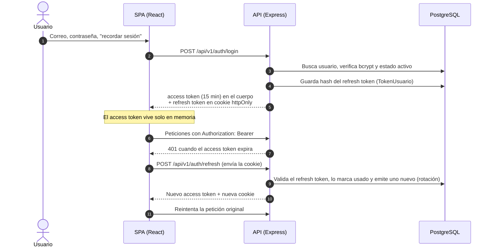
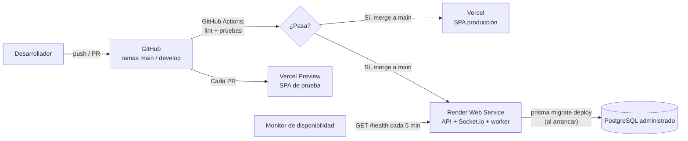

# HomeScope — Documento de arquitectura

## *TODO COLABORACIÓN AL PROYECTO DEBE REALIZARSE A TRAVÉS DE GIT, PROHIBIDA LA COLABORACION POR MEDIO DE CORREO ELECTRONICO U OTRO MEDIO*

| Campo | Valor |
| --- | --- |
| Proyecto | HomeScope — Plataforma de compra, venta y alquiler de propiedades con Índice de Conveniencia |
| Curso | Desarrollo Web — Universidad Mariano Gálvez de Guatemala, Centro Universitario de Jalapa |
| Versión | 1.1 — Cambio de motor de base de datos: SQL Server → PostgreSQL |
| Fecha | 24 de septiembre de 2026 |
| Responsable | Keily López (Arquitectura / Backend Lead) — HU-01, T01 |
| Estado | Borrador para aprobación del grupo |


---

## 1. Introducción

### 1.1 Propósito

Este documento describe la arquitectura de HomeScope: los componentes que la forman, cómo se comunican, dónde se despliegan y qué decisiones se tomaron para cumplir los requerimientos no funcionales. Es la referencia técnica común del equipo y el entregable de arquitectura de la T1.

### 1.2 Alcance

Cubre el frontend, el backend, la base de datos, los servicios externos (Google Maps Platform, Cloudinary, correo) y la infraestructura de despliegue (Vercel, Render). Los diagramas siguen el modelo C4 en sus tres primeros niveles: contexto, contenedores y componentes.


---

## 2. Contexto y restricciones

HomeScope es una plataforma web donde los vendedores publican propiedades y los compradores las buscan, comparan y contactan. Su diferenciador es el **Índice de Conveniencia**: un puntaje calculado a partir de los puntos de interés cercanos (educación, salud, comercio, transporte, seguridad y áreas verdes) que se muestra como un semáforo con su desglose.

Las restricciones que condicionan la arquitectura son:

- **Tiempo:** 3 sprints de una semana, del 22 de septiembre al 10 de octubre de 2026.
- **Equipo:** 6 integrantes (1 arquitecta/backend lead, 2 backend, 2 frontend, 1 fullstack/DevOps).
- **Tecnologías definidas por el curso:** React.js con Tailwind CSS en el frontend, Node.js con Express en el backend.
- **Presupuesto:** cero. Todo debe funcionar con los planes gratuitos de Vercel, Render, Cloudinary, Google Maps Platform y el proveedor de base de datos.
- **Despliegue reproducible** desde el repositorio (RNF-12).


---

## 3. Atributos de calidad (FURPS+)

Esta tabla relaciona cada requerimiento no funcional con la táctica arquitectónica que lo atiende.

| Categoría FURPS+ | RNF | Requerimiento | Táctica arquitectónica |
| --- | --- | --- | --- |
| Performance | RNF-01 | Ficha de propiedad en ≤ 3 s | Índice y puntos de interés precalculados y guardados en BD (caché); el mapa se carga en el cliente; imágenes optimizadas por Cloudinary |
| Performance / Escalabilidad | RNF-02 | Crecimiento del catálogo sin rediseño | Paginación en todos los listados; índices en PostgreSQL; cálculo del índice en segundo plano |
| Reliability | RNF-03 | Disponibilidad ≥ 95 % | Endpoint `/health` monitoreado; plataformas administradas; respaldos de BD (sección 11.4) |
| Supportability (seguridad) | RNF-04 | HTTPS en toda la aplicación | TLS provisto por Vercel y Render; cookies `Secure` |
| Supportability (seguridad) | RNF-05 | JWT con expiración y renovación | Access token corto + refresh token rotativo en cookie `httpOnly` |
| Supportability (seguridad) | RNF-06 | Prevención de inyección SQL y XSS | Consultas parametrizadas (Prisma); validación de esquemas con Zod; React escapa por defecto |
| Supportability (seguridad) | RNF-07 | Rate limiting en publicación y mensajes | `express-rate-limit` por usuario e IP en rutas sensibles |
| Privacy | RNF-08 | Contacto oculto hasta autorización | DTOs públicos sin datos de contacto; regla de conversación previa en el servicio |
| Usability | RNF-09 | Interfaz responsiva | Tailwind CSS con diseño *mobile first* |
| Usability | RNF-10 | Índice comprensible | Desglose por categoría y puntos de interés usados, guardados junto al índice |
| Supportability | RNF-11 | Código en capas y documentado | Monolito modular con capas por módulo; OpenAPI; README |
| Supportability (portabilidad) | RNF-12 | Despliegue reproducible | Variables de entorno; migraciones versionadas; despliegue automático desde `main` |
| Functionality (consistencia) | RNF-13 | Mismo criterio de índice para todas las propiedades | Pesos en BD con versión del algoritmo; recálculo masivo al cambiar pesos |
| Supportability (compatibilidad) | RNF-14 | Chrome, Edge y Firefox | Build de Vite con objetivos de navegadores modernos; pruebas manuales en los tres |

---

## 4. Vista de contexto (C4 — nivel 1)

Muestra a HomeScope como una caja negra, quién lo usa y con qué sistemas externos se comunica.



| Actor o sistema | Descripción |
| --- | --- |
| Visitante | Persona sin sesión. Puede consultar el catálogo, las fichas, el mapa y el índice. |
| Comprador | Busca, guarda favoritos, compara, conversa con vendedores, agenda visitas y deja reseñas. |
| Vendedor | Publica y gestiona propiedades, define su disponibilidad, responde mensajes y ve sus estadísticas. |
| Administrador | Verifica vendedores, atiende reportes, modera publicaciones y comentarios, gestiona cuentas. |
| Google Maps Platform | Mapa interactivo, vista satelital y Street View (Maps JavaScript API), búsqueda de puntos de interés (Places API) y conversión de direcciones a coordenadas (Geocoding API). |
| Cloudinary | Almacena las fotos de las propiedades y las entrega redimensionadas y comprimidas. |
| Servicio SMTP | Envía correos de verificación, recuperación de contraseña, notificaciones y recordatorios. |

---

## 5. Vista de contenedores (C4 — nivel 2)

Un contenedor es una aplicación o almacén de datos que se ejecuta por separado.



| Contenedor | Tecnología | Responsabilidad |
| --- | --- | --- |
| Aplicación web (SPA) | React 18, Vite, Tailwind CSS, React Router, TanStack Query, React Hook Form, Socket.io client | Interfaz de usuario. Renderiza mapas en el cliente, gestiona la sesión y consume la API. |
| API HomeScope | Node.js 20 LTS, Express, Prisma, Socket.io, pg-boss, Zod | Lógica de negocio, autenticación y autorización, persistencia, integración con servicios externos, mensajería en tiempo real y procesos en segundo plano. |
| PostgreSQL | PostgreSQL 16 | Base de datos relacional del negocio. También aloja la cola de trabajos de pg-boss, lo que evita tener que agregar Redis. |

**Por qué un solo contenedor de backend:** la API, el servidor de Socket.io y los procesos en segundo plano corren en el mismo proceso de Node.js. Con los planes gratuitos, un segundo servicio (por ejemplo, un *worker* separado) duplicaría la gestión y los límites de uso. Como los trabajos se encolan en PostgreSQL mediante pg-boss, separar el *worker* más adelante solo requiere desplegar el mismo código con otro comando de arranque (ver ADR-05).

---

## 6. Vista de componentes del backend (C4 — nivel 3)

### 6.1 Estilo: monolito modular

El backend es un **monolito modular**: una sola aplicación desplegable, dividida en módulos alineados con las áreas del negocio. Cada módulo encapsula sus rutas, reglas de negocio y acceso a datos, y se comunica con los demás solo a través de sus servicios, nunca accediendo directamente a las tablas de otro módulo.

Esta división sigue la idea de contextos delimitados de DDD en una versión ligera: los módulos coinciden con los del modelo de datos y con las épicas del backlog, lo que permite asignar responsables por módulo.



### 6.2 Capas dentro de cada módulo

Cada módulo mantiene las carpetas definidas en la HU-04 (`routes`, `controllers`, `models`, `services`) y agrega dos capas para aislar el acceso a datos y los servicios externos, siguiendo el principio de la arquitectura hexagonal: **la lógica de negocio no depende de detalles técnicos**.

| Capa | Responsabilidad | Puede depender de |
| --- | --- | --- |
| `routes` | Declara los endpoints, el middleware de autenticación y el permiso requerido | `controllers` |
| `controllers` | Traduce HTTP ↔ casos de uso: valida la entrada con Zod, llama al servicio y arma la respuesta | `services`, `dto` |
| `services` | Casos de uso y reglas de negocio (por ejemplo, "solo el dueño edita", "cambiar el precio registra historial") | `repositories`, puertos, servicios de otros módulos |
| `repositories` | Acceso a datos con Prisma; única capa que conoce las tablas | Prisma Client |
| `models` | Tipos y DTOs del módulo; el esquema de tablas vive en `prisma/schema.prisma` | — |
| Puertos y adaptadores | Interfaces de servicios externos (`MapsPort`, `StoragePort`, `MailPort`, `RealtimePort`, `JobPort`) y sus implementaciones | SDK externos |

**Reglas de dependencia:**

1. Los `services` nunca importan Express, Prisma ni SDKs externos directamente; usan repositorios y puertos. Así el cálculo del índice puede probarse con un `MapsPort` simulado, sin llamar a Google.
2. Un módulo solo usa otro módulo a través de su servicio. Por ejemplo, Reputación consulta a Comunicación si existe una conversación, en lugar de leer la tabla `conversacion`.
3. La autorización se declara en las rutas por **código de permiso** (`requirePermission('propiedad.publicar')`), según la matriz de roles y permisos. Las verificaciones de dueño y de condiciones de negocio se hacen en los servicios.

### 6.3 Estructura de carpetas del backend

```text
homescope-api/
├── prisma/
│   ├── schema.prisma            # Modelo de datos (fuente de verdad)
│   ├── migrations/              # Migraciones versionadas
│   └── seed.ts                  # Roles, permisos, tipos, categorías
├── src/
│   ├── app.js                   # Express: middleware y montaje de módulos
│   ├── server.js                # HTTP + Socket.io + arranque de pg-boss
│   ├── config/                  # Variables de entorno validadas con Zod
│   ├── shared/
│   │   ├── middleware/          # auth, requirePermission, rateLimit, errorHandler
│   │   ├── errors/              # AppError, NotFound, Forbidden...
│   │   ├── ports/               # MapsPort, StoragePort, MailPort, RealtimePort, JobPort
│   │   └── adapters/            # google-maps, cloudinary, mail, socket, pg-boss
│   ├── modules/
│   │   ├── identidad/
│   │   │   ├── identidad.routes.js
│   │   │   ├── identidad.controller.js
│   │   │   ├── identidad.service.js
│   │   │   ├── identidad.repository.js
│   │   │   └── identidad.schemas.js   # Validación Zod y DTOs
│   │   ├── propiedades/
│   │   ├── geo-indice/
│   │   ├── busqueda/
│   │   ├── comunicacion/
│   │   ├── agenda/
│   │   ├── reputacion/
│   │   └── moderacion/
│   └── jobs/                    # calcular-indice, enviar-correo, recordatorios, expiraciones
├── tests/                       # Jest + Supertest
├── docs/openapi.yaml            # Documentación de endpoints
└── README.md
```

### 6.4 Convenciones de la API

- **Versionado:** todas las rutas bajo `/api/v1`.
- **Formato:** JSON; nombres de campos en `camelCase` en la API y en `snake_case` en la base de datos (Prisma hace el mapeo con `@map`).
- **Paginación:** `?page=1&pageSize=20`; la respuesta incluye `total`, `page` y `pageSize`. Ningún listado devuelve registros sin paginar (RNF-02).
- **Errores:** formato único `{ "error": { "code": "PROPIEDAD_NO_ENCONTRADA", "message": "...", "details": [...] } }` con el código HTTP correspondiente (400, 401, 403, 404, 409, 422, 429, 500).
- **Documentación:** `docs/openapi.yaml` servido en `/api/docs` con Swagger UI (RNF-11, HU-31).
- **Salud:** `GET /health` responde el estado de la API y de la conexión a la base de datos.

---

## 7. Arquitectura de datos

### 7.1 Motor: PostgreSQL 16

El modelo de datos (27 tablas en 5 módulos) se mantiene igual en entidades y relaciones; lo que cambia es la implementación física. PostgreSQL aporta varias capacidades que simplifican requerimientos concretos del proyecto:

| Capacidad de PostgreSQL | Requerimiento que simplifica |
| --- | --- |
| Índices únicos parciales (`WHERE es_portada`) | Una sola foto de portada y un solo índice vigente por propiedad |
| Búsqueda de texto completo con configuración `spanish` y extensión `unaccent` | Búsqueda por texto en título, descripción y dirección sin distinguir tildes (RF-18) |
| Tipo `JSONB` con índice GIN | Criterios de búsquedas guardadas (RF-28) |
| Extensión `citext` | Correo único sin distinguir mayúsculas |
| `TIMESTAMPTZ` | Fechas guardadas en UTC y convertidas a la zona `America/Guatemala` |
| pg-boss (cola de trabajos sobre la misma BD) | Cálculo del índice en segundo plano, correos, recordatorios y expiraciones sin Redis |
| PostGIS (opcional, evolución) | Consultas geoespaciales avanzadas si el catálogo crece |

### 7.2 Equivalencia de tipos (SQL Server → PostgreSQL)

| SQL Server (v1.0) | PostgreSQL (v1.1) | Nota |
| --- | --- | --- |
| `INT IDENTITY` | `INTEGER GENERATED ALWAYS AS IDENTITY` | En Prisma: `Int @id @default(autoincrement())` |
| `BIGINT IDENTITY` | `BIGINT GENERATED ALWAYS AS IDENTITY` | Tablas de alto volumen: VistaPropiedad, Mensaje, Notificacion |
| `TINYINT` | `SMALLINT` | PostgreSQL no tiene `TINYINT` |
| `BIT` | `BOOLEAN` | |
| `NVARCHAR(n)` | `VARCHAR(n)` | PostgreSQL usa UTF-8 de forma nativa |
| `NVARCHAR(MAX)` | `TEXT` | |
| `NVARCHAR(MAX)` con JSON | `JSONB` | `BusquedaGuardada.criterios_json` |
| `DATETIME2` | `TIMESTAMPTZ` | |
| `DECIMAL(p,s)` | `NUMERIC(p,s)` | Precios y coordenadas |
| `TIME` | `TIME` | Franjas de disponibilidad |
| Índice único filtrado | Índice único parcial | Misma idea, sintaxis `CREATE UNIQUE INDEX ... WHERE ...` |
| `ISJSON()` en `CHECK` | Validación implícita del tipo `JSONB` | |

**Convenciones de nombres:** tablas y columnas en `snake_case` y en singular (`propiedad`, `foto_propiedad`, `historial_precio`). PostgreSQL convierte a minúsculas los identificadores sin comillas, así que usar `snake_case` evita tener que escribir comillas en cada consulta. Los enumerados (`estado`, `tipo`, `accion`) se implementan como `VARCHAR` con `CHECK`, que es más fácil de modificar en una migración que un tipo `ENUM` nativo.

### 7.3 Reglas implementadas en la base de datos

```sql
-- Extensiones
CREATE EXTENSION IF NOT EXISTS citext;
CREATE EXTENSION IF NOT EXISTS unaccent;

-- Una sola portada por propiedad
CREATE UNIQUE INDEX ux_foto_portada ON foto_propiedad (propiedad_id) WHERE es_portada;

-- Un solo índice vigente por propiedad
CREATE UNIQUE INDEX ux_indice_vigente ON indice_conveniencia (propiedad_id) WHERE es_vigente;

-- Una conversación por propiedad y comprador; una reseña por comprador y propiedad
ALTER TABLE conversacion ADD CONSTRAINT ux_conversacion UNIQUE (propiedad_id, comprador_id);
ALTER TABLE resena ADD CONSTRAINT ux_resena UNIQUE (comprador_id, propiedad_id);
ALTER TABLE resena ADD CONSTRAINT ck_calificacion CHECK (calificacion BETWEEN 1 AND 5);

-- Búsqueda de texto completo en español, sin distinguir tildes
-- (unaccent se envuelve en una función IMMUTABLE para poder usarla en índices)
CREATE OR REPLACE FUNCTION f_unaccent(text) RETURNS text
  LANGUAGE sql IMMUTABLE PARALLEL SAFE STRICT
  AS $$ SELECT public.unaccent('public.unaccent', $1) $$;

CREATE INDEX ix_propiedad_texto ON propiedad USING GIN (
  to_tsvector('spanish', f_unaccent(titulo || ' ' || coalesce(descripcion, '') || ' ' || coalesce(direccion, '')))
);
```

### 7.4 Índices principales

| Tabla | Índice | Uso |
| --- | --- | --- |
| propiedad | `(estado, tipo_propiedad_id, modalidad, precio)` | Búsqueda con filtros (HU-20) |
| propiedad | `(latitud, longitud)` | Búsqueda por área del mapa (HU-21, T53) |
| propiedad | GIN de texto completo | Búsqueda por texto |
| indice_conveniencia | `(es_vigente, puntaje_total)` | Filtro por índice |
| vista_propiedad | `(propiedad_id, fecha_vista)` y `(usuario_id, fecha_vista)` | Estadísticas del vendedor e historial del comprador |
| mensaje | `(conversacion_id, fecha_envio)` | Historial de una conversación |
| punto_interes | `(propiedad_id, categoria_id)` | Ficha y cálculo del índice |
| notificacion | `(usuario_id, leida, fecha_creacion)` | Bandeja de notificaciones |

### 7.5 Acceso a datos y migraciones

- **ORM:** Prisma. El archivo `prisma/schema.prisma` es la fuente de verdad del modelo; el diagrama ER debe mantenerse sincronizado con él.
- **Migraciones:** `prisma migrate dev` en desarrollo y `prisma migrate deploy` en el despliegue. Las reglas que Prisma no expresa (índices parciales, `CHECK`, texto completo, extensiones) se agregan como SQL dentro de la migración correspondiente.
- **Datos iniciales:** `prisma/seed.ts` carga roles, permisos (de la matriz), tipos de propiedad y categorías de interés con sus pesos.
- **Consultas especiales:** la búsqueda por texto y por área del mapa usan `prisma.$queryRaw` con parámetros, nunca concatenando texto del usuario.

---

## 8. Arquitectura del frontend

```text
homescope-web/
├── src/
│   ├── app/                 # Router, proveedores (Query, Auth, Socket), layout
│   ├── features/            # Un directorio por funcionalidad, espejo de los módulos del backend
│   │   ├── auth/            # Registro, login, recuperación, perfil
│   │   ├── propiedades/     # Formulario por pasos, fotos, gestión
│   │   ├── mapa/            # Mapa, satélite, Street View, puntos de interés
│   │   ├── indice/          # Semáforo y desglose
│   │   ├── busqueda/        # Catálogo, filtros, búsqueda en mapa
│   │   ├── favoritos/       # Favoritos y comparador
│   │   ├── mensajes/        # Bandeja y chat en tiempo real
│   │   ├── agenda/          # Disponibilidad y visitas
│   │   ├── resenas/
│   │   └── admin/           # Panel de administración
│   ├── shared/
│   │   ├── api/             # Cliente HTTP con renovación automática del token
│   │   ├── components/      # Botones, tarjetas, modales, layout responsivo
│   │   └── hooks/
│   └── main.jsx
└── vite.config.js
```

| Aspecto | Decisión |
| --- | --- |
| Estado del servidor | TanStack Query: caché, reintentos y actualización de listados sin recargar la página (criterio de HU-20). |
| Estado de sesión | Contexto de React con el usuario, sus roles y permisos. El access token vive solo en memoria. |
| Formularios | React Hook Form con los mismos esquemas Zod del backend cuando sea posible. |
| Mapas | Maps JavaScript API cargada en el cliente con su propia API key restringida por dominio. |
| Tiempo real | Socket.io client conectado tras el login; recibe mensajes y notificaciones. |
| Rutas protegidas | Componentes que ocultan pantallas según los permisos. Es solo experiencia de usuario: la protección real está en el backend. |

---

## 9. Integraciones externas

| Servicio | Quién lo llama | Uso | Consideraciones |
| --- | --- | --- | --- |
| Maps JavaScript API | Frontend | Mapa, satélite, Street View, marcadores, autocompletado de direcciones | API key restringida por *HTTP referrer* al dominio de Vercel y a `localhost`. |
| Places API | Backend | Puntos de interés por categoría para el índice y la ficha | API key restringida a las APIs usadas. Una consulta de 2 km por categoría; los radios menores se filtran por distancia (ver PuntoInteres en el diccionario). Resultados guardados en BD. |
| Geocoding API | Backend | Validar y normalizar la dirección, obtener zona y municipio | Se llama al guardar la ubicación, no en cada visita. |
| Cloudinary | Frontend (subida) y backend (firma y borrado) | Fotos de propiedades | **Subida firmada directa:** el backend genera una firma y el navegador sube la foto directo a Cloudinary; la API no transporta archivos. Los documentos de verificación de vendedor se suben como recursos privados (`type: authenticated`). |
| SMTP (Nodemailer) | Backend, vía cola de trabajos | Verificación, recuperación, notificaciones, recordatorios | Los correos se encolan en pg-boss y se reintentan si fallan; el usuario no espera el envío. |

Todos los adaptadores implementan un puerto (`MapsPort`, `StoragePort`, `MailPort`), de modo que cambiar de proveedor o simularlo en pruebas no afecta la lógica de negocio.

---

## 10. Flujos principales

### 10.1 Publicación de una propiedad y cálculo del Índice de Conveniencia

El cálculo se hace en segundo plano para que publicar sea inmediato (criterio de HU-17) y la ficha cargue en menos de 3 segundos (RNF-01).



Si la ubicación cambia (RF-17), el servicio de propiedades encola el mismo trabajo. Si Google Places falla, pg-boss reintenta con espera exponencial y la ficha muestra "índice en cálculo" mientras tanto.

### 10.2 Autenticación con renovación de token



- **Duración:** access token de 15 minutos; refresh token de 1 día, o de 30 días con "recordar sesión".
- **Rotación:** cada refresh token sirve una sola vez. Si se presenta uno ya usado, se revocan todas las sesiones del usuario, porque indica un posible robo del token.
- **Cookie entre dominios:** como el frontend (Vercel) y la API (Render) están en dominios distintos, la cookie debe configurarse con `SameSite=None; Secure; HttpOnly` y CORS con `credentials: true` limitado al dominio del frontend. Si más adelante se usa un dominio propio con subdominios (`app.` y `api.`), puede pasarse a `SameSite=Lax`.

### 10.3 Mensajería en tiempo real

1. Al iniciar sesión, la SPA abre una conexión Socket.io autenticada con el access token; el servidor une el socket a una sala `usuario:{id}`.
2. El comprador envía un mensaje por REST (`POST /api/v1/conversaciones/{id}/mensajes`). Usar REST para escribir permite reutilizar la validación, la autorización y el rate limiting.
3. La API guarda el mensaje, actualiza la conversación, crea la notificación y emite `mensaje:nuevo` a la sala del destinatario.
4. Si el destinatario no está conectado, lo verá al volver; si tiene activado el aviso por correo, se encola el envío.

---

## 11. Despliegue e infraestructura

### 11.1 Diagrama de despliegue



### 11.2 Ambientes

| Ambiente | Frontend | Backend | Base de datos |
| --- | --- | --- | --- |
| Local | `vite dev` | `node --watch` | PostgreSQL en Docker (`postgres:16`) |
| Preview | Vercel Preview por cada PR | API de producción o de desarrollo | BD de desarrollo |
| Producción | Vercel (rama `main`) | Render (rama `main`) | PostgreSQL administrado (Render PostgreSQL o Neon) |

### 11.3 Variables de entorno

| Variable | Contenedor | Descripción |
| --- | --- | --- |
| `DATABASE_URL` | API | Cadena de conexión de PostgreSQL con `sslmode=require` |
| `JWT_ACCESS_SECRET`, `JWT_REFRESH_SECRET` | API | Secretos de firma de tokens |
| `CORS_ORIGIN` | API | Dominio del frontend en Vercel |
| `GOOGLE_MAPS_SERVER_KEY` | API | Key para Places y Geocoding |
| `CLOUDINARY_URL` | API | Credenciales de Cloudinary |
| `SMTP_HOST`, `SMTP_USER`, `SMTP_PASS`, `MAIL_FROM` | API | Servidor de correo |
| `VITE_API_URL` | SPA | URL pública de la API |
| `VITE_GOOGLE_MAPS_BROWSER_KEY` | SPA | Key para Maps JavaScript API (restringida por dominio) |
| `VITE_CLOUDINARY_CLOUD_NAME` | SPA | Nombre de la cuenta de Cloudinary |

Ningún secreto se sube al repositorio. El archivo `.env.example` documenta las variables sin valores reales. Las variables con prefijo `VITE_` quedan visibles en el navegador, por eso solo deben contener datos públicos o keys restringidas por dominio.

### 11.4 Disponibilidad y respaldos

| Métrica | Objetivo | Cómo se cumple |
| --- | --- | --- |
| Disponibilidad (SLA interno) | ≥ 95 % durante la evaluación (RNF-03) | Plataformas administradas; monitor externo sobre `/health` |
| RPO (pérdida máxima de datos) | 24 horas | Respaldo diario de la BD (automático del proveedor o `pg_dump` programado) |
| RTO (tiempo máximo de recuperación) | 4 horas | Restaurar el respaldo en una BD nueva, actualizar `DATABASE_URL` y redesplegar |

**Riesgo de los planes gratuitos:** los planes gratuitos de estas plataformas suelen suspender los servicios tras un periodo de inactividad (el primer acceso posterior tarda en responder) y pueden limitar la duración o el tamaño de las bases de datos. Hay que revisar las condiciones vigentes de cada proveedor al configurar la infraestructura en el Sprint 1. El monitor de `/health` ayuda a mantener activa la API, y antes de la demostración final conviene "despertar" el servicio.

---

## 12. Seguridad

| Amenaza o control | Implementación |
| --- | --- |
| Autenticación | JWT con access token corto y refresh token rotativo (sección 10.2). Contraseñas con bcrypt (costo 12). |
| Autorización | Permisos por código según la matriz de roles; verificación de dueño y de condiciones en los servicios. Cuentas suspendidas pierden todo acceso aunque tengan un token vigente. |
| Inyección SQL | Prisma parametriza todas las consultas; `$queryRaw` solo con parámetros etiquetados, nunca con concatenación. |
| XSS | React escapa el contenido por defecto; no se usa `dangerouslySetInnerHTML` con contenido de usuarios; mensajes y comentarios se sanitizan al guardar. |
| Validación de entradas | Esquemas Zod en cada endpoint: tipos, longitudes, rangos (precio, calificación 1-5, radios permitidos). |
| Abuso y fuerza bruta | `express-rate-limit`: login y recuperación por IP; publicación y mensajes por usuario (RNF-07). |
| Cabeceras HTTP | `helmet` con CSP que permite los dominios de Google Maps y Cloudinary. |
| CORS | Solo el dominio del frontend, con credenciales. |
| Datos sensibles | Contacto oculto hasta que exista conversación (RNF-08); documentos de verificación como recursos privados; nunca se registran contraseñas ni tokens en los logs. |
| Transporte | HTTPS obligatorio en Vercel y Render; conexión a PostgreSQL con TLS (`sslmode=require`). |
| Revisión | Checklist OWASP Top 10 en la T29 antes del despliegue final. |

---

## 13. Registro de decisiones de arquitectura (ADR)

| ID | Decisión | Alternativas consideradas | Motivo |
| --- | --- | --- | --- |
| ADR-01 | Monolito modular con capas por módulo | Microservicios; monolito sin módulos | Un solo despliegue es viable en 3 semanas y con planes gratuitos. Los módulos permiten trabajar en paralelo y dividir el sistema en el futuro si fuera necesario. |
| ADR-02 | PostgreSQL 16 como base de datos | SQL Server; MySQL | Hosting administrado gratuito disponible junto a Render y en proveedores como Neon, a diferencia de SQL Server. Aporta índices parciales, JSONB, texto completo en español y permite la cola de trabajos sin Redis. Opción de PostGIS para crecer. |
| ADR-03 | Prisma como ORM y herramienta de migraciones | Sequelize; Knex; `pg` sin ORM | Esquema declarativo legible por todo el equipo, migraciones versionadas y consultas parametrizadas por defecto. Las consultas especiales usan SQL parametrizado. |
| ADR-04 | JWT de acceso en memoria + refresh token rotativo en cookie `httpOnly` | JWT de larga duración en `localStorage`; sesiones en servidor | Cumple RNF-05, reduce el impacto de un robo de token por XSS y no requiere almacenar sesiones en memoria del servidor. |
| ADR-05 | Procesos en segundo plano con pg-boss dentro del mismo servicio | BullMQ + Redis; `setTimeout` en memoria | Reintentos y persistencia de los trabajos sin agregar otra infraestructura. Separable a un *worker* dedicado sin cambiar el código. |
| ADR-06 | Socket.io para tiempo real, escritura por REST | WebSocket puro; *polling* | Reconexión automática y salas por usuario. Escribir por REST reutiliza validación, autorización y rate limiting. |
| ADR-07 | Subida directa y firmada a Cloudinary | Subir las fotos a través de la API | La API no transporta archivos pesados, lo que reduce memoria y tiempo de respuesta en el plan gratuito. |
| ADR-08 | Índice y puntos de interés precalculados en BD | Calcular al abrir cada ficha | Cumple RNF-01 y RNF-13, reduce llamadas pagadas a Google y permite explicar el resultado (RNF-10). |
| ADR-09 | Enumerados como `VARCHAR` + `CHECK` | Tipos `ENUM` de PostgreSQL | Agregar o cambiar un valor es una migración simple; los `ENUM` nativos son más rígidos de modificar. |

---

## 14. Riesgos técnicos

| Riesgo | Impacto | Mitigación |
| --- | --- | --- |
| Suspensión por inactividad o límites del plan gratuito | Primera carga lenta; posible incumplimiento de RNF-01 en la demo | Monitor de `/health`; revisar condiciones del plan en el Sprint 1; despertar el servicio antes de presentar |
| Cuota o costo de Google Maps Platform | Fallos del mapa o del índice | Resultados en caché; alertas de presupuesto en Google Cloud; keys restringidas |
| El algoritmo del índice (T11) y su implementación (T17) están en el mismo sprint | Retraso de la funcionalidad principal | Acordar primero la interfaz del cálculo (entradas y salidas) para que T17 avance con pesos provisionales |
| Cambio de SQL Server a PostgreSQL con el Sprint 1 en curso | Retrabajo en la configuración inicial (T05) | El cambio ocurre antes de crear tablas; actualizar criterios de HU-04 y tecnologías de las tareas |
| Cookies entre dominios distintos (Vercel y Render) | La renovación de sesión falla en algunos navegadores | `SameSite=None; Secure`; probar en Chrome, Edge y Firefox (RNF-14); evaluar dominio propio |
| Sprint 2 sobrecargado (96 de 165 puntos) | Funcionalidades incompletas al final | Replanificación propuesta en el análisis de distribución por sprint |

---


